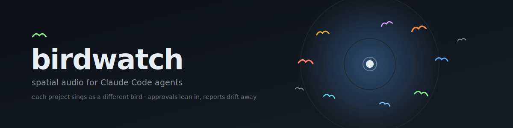
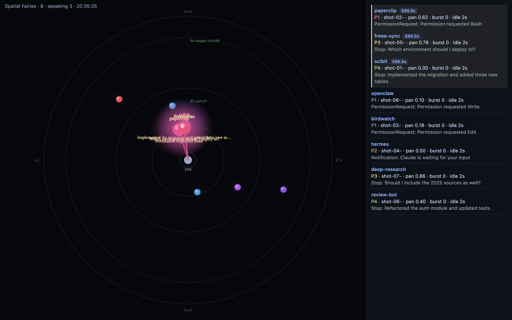

# birdwatch

[](LICENSE)  

**Notification fatigue?** Let your workspace go wild. With birdwatch, every
Claude Code session becomes a real bird singing somewhere around you — so each
ping that used to spike your stress arrives instead as birdsong drifting through
a forest. Glance up only when the chorus calls; the rest of the time, just enjoy
the quiet woodland your terminal has become.

Spatial audio monitoring for Claude Code. Every project sings as a different
**real bird species**, so you can hear which of your sessions needs you without
looking. Approvals lean in close to your ear; background reports drift far away
and quiet. Built as hooks — no model tokens, no chat noise.

- **project → bird species** — each project gets a distinct call (28 species, Wikimedia Commons)
- **session → pan** — each session has a fixed left/right home position
- **event → distance** — approvals (Tier A) up close & loud; reports (Tier B) far, soft, low-pass
- **storm control** — same-project reports are throttled to one chirp / 15s

A live dashboard visualizes sessions as birds orbiting you, approaching when they speak.



## Install (private marketplace)

```
/plugin marketplace add kgkgzrtk/birdwatch
/plugin install birdwatch@birdwatch
```

## Requirements

- `sox` and `jq` on `PATH` (the dispatcher exits silently if missing)
- macOS `afplay` for playback
- `python3` for the dashboard

## Commands

- `/birdwatch:dashboard` — launch the orbit dashboard at http://localhost:8765
- `/birdwatch:inbox` — list pending approvals/questions across all sessions

## Multi-harness support

birdwatch is harness-agnostic — any agent runtime that can run a command on
its events can sing. Claude Code is covered by the plugin itself; adapters for
other harnesses ship in [`adapters/`](adapters/). All of them write to the
same store, so the inbox and dashboard show every harness side by side. Set
`BIRDWATCH_STATE_DIR` when you mix harnesses so the plugin and the adapters
share one store.

**OpenAI Codex CLI** — point `notify` at the adapter in `~/.codex/config.toml`
(chain an existing notifier after `--chain` to keep it working):

```toml
notify = ["bash", "/path/to/birdwatch/adapters/codex/notify.sh"]
# or: ["bash", ".../adapters/codex/notify.sh", "--chain", "/path/to/your-notifier", "arg", "--"]
```

**Hermes** — install the hook and restart the gateway:

```
cp -R adapters/hermes ~/.hermes/hooks/birdwatch
```

**OpenClaw** — `adapters/openclaw` is an official hook pack (npm package with
`openclaw.hooks`); install it with the plugins CLI:

```
openclaw plugins install /path/to/birdwatch/adapters/openclaw
openclaw hooks enable birdwatch
openclaw gateway restart
```

Adapters resolve the dispatcher at `~/github/birdwatch/scripts/dispatch.sh` by
default; override with `BIRDWATCH_DISPATCH`.

## Tuning

| Env | Effect |
|---|---|
| `BIRDWATCH_OFF=1` | mute everything |
| `BIRDWATCH_RATE_LIMIT` | per-session min seconds between chirps (default 4) |
| `BIRDWATCH_TIER_B_COOLDOWN` | per-project report cooldown seconds (default 15) |
| `BIRDWATCH_DASH_PORT` | dashboard port (default 8765) |
| `BIRDWATCH_STATE_DIR` | shared state dir across harnesses (wins over `CLAUDE_PLUGIN_DATA`) |
| `BIRDWATCH_DISPATCH` | dispatcher path used by harness adapters |

Runtime state lives in `${CLAUDE_PLUGIN_DATA}/birdwatch`. To add or refresh species,
edit the `SPECIES` list in `scripts/birds-bootstrap.sh` and re-run it (appends to the
end so existing project→bird mappings stay stable).

## License

This repository is **mixed-license**:

- **Code** — scripts, manifests, dashboard, and banner artwork — is MIT, see [`LICENSE`](LICENSE).
- **Bird recordings** in `assets/birds/samples/` are sourced from Wikimedia Commons and
  individually licensed **CC BY-SA 4.0 / 3.0**, **CC BY 2.5**, or **Public Domain** (none
  NonCommercial or NoDerivatives). They are modified excerpts (trimmed, normalized) and are
  **not** covered by the MIT license. Redistribution must preserve attribution and share-alike
  per [`assets/birds/ATTRIBUTIONS.md`](assets/birds/ATTRIBUTIONS.md).
